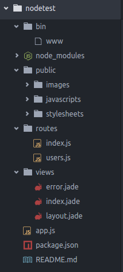
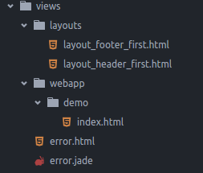
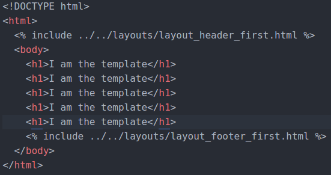
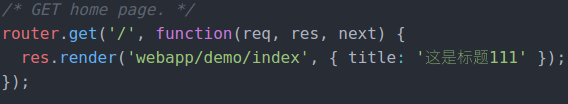
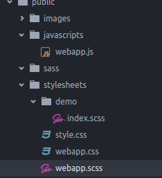
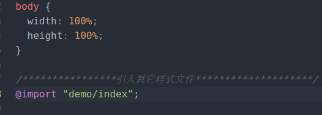

- 使用express应用生成器
```
cnpm install express-generator -g
```
- 生成nodetest应用，并生成依赖包
```
express nodetest
cd nodetest
cnpm i
```
- 项目目录

- 启动项目
```
DEBUG=myapp npm start
或者　npm run start
// 打开localhost:3000即可看到view中index.jade页面
```
- 配置supervisor，每次修改代码后自动重启node
```
cnpm install supervisor --save
// 将package.json中的"start": "node ./bin/www"改为
"start": "supervisor ./bin/www"
// 再次启动该应用，即可实现每次修改代码后自动重启应用
```
- 使项目中的view支持html文件(ejs不能模板继承，这有点蛋疼，而jade用起来怪别扭的，建议寻找第三方模板)
```
cnpm install ejs --save
// 进入app.js
// 将原来的app.set('view engine', 'jade')改为
var ejs = require('ejs');
app.engine('.html', ejs.__express);　//让ejs能够识别后缀为'.html'的文件
app.set('view engine', 'html'); // 使在调用render函数时能自动为我们加上'.html'后缀
// 这样就可以在html文件内直接引用ejs语法
```
- 虽然ejs模板无layout，但可以构造共同模块

// index.html页面

// 路由index.js设置

- 构造路由(目前最简单的操作就是直接往index.js内添加路由即可)
- 调用css预处理器sass(不好的地方在于会生成一个命名一样的css文件，但可以用一个总文件来引入其它样式文件)
```
cnpm install node-sass-middleware --save
// 在app引入，对scss文件进行转换
var sassMiddleware = require('node-sass-middleware');
// adding the sass middleware(中间件)
app.use(
   sassMiddleware({
       src: __dirname + '/public',
       dest: __dirname + '/public',
       debug: true
   })
);
// (注意)sassMiddleware必须要放在处理静态文件路径之前
// 页面上直接引用新生成的css文件即可
```


- 目前最基本的搭配就这样，后期会陆续引入webapck/gulp/mysql及后端的一些逻辑写法
- 推荐 https://segmentfault.com/a/1190000003846509 里面有一些最基本的用法说明
